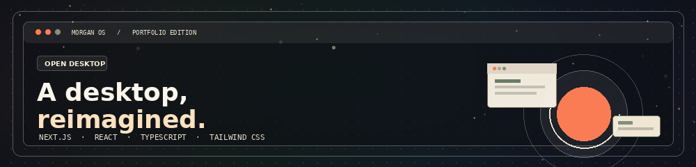
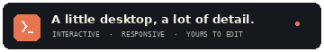
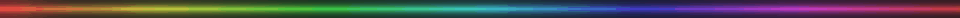

<div align="center">
  
  <br />
  
  <h1>Morgan OS · Portfolio template</h1>
  <p>A portfolio that feels like a small, considered desktop: draggable windows, a dock, a terminal, work, writing, and a way to say hello.</p>
  <p><strong>Next.js 16 · React 19 · TypeScript · Tailwind CSS 4 · GitHub Pages</strong></p>
</div>

<p align="center"></p>

> **A note about the demo content:** Morgan Ellis and the projects in this repository are sample content. Replace the name, copy, links, and artwork with your own before publishing. The reference study and recreation notes are in [`DESIGN-NOTES.md`](DESIGN-NOTES.md).

## What’s inside

This is a working portfolio, not just a static mockup. The familiar desktop shell is the navigation: open an app from the dock, move its window, and follow the project or writing links inside it.

- **About** — short profile, working style, skills, and links.
- **Selected work** — six case files, a compact timeline, category filters, and project detail windows.
- **Journal** — four sample articles with full reading views.
- **Experience** — a scannable work timeline.
- **Contact** — an accessible form that prepares an email in the visitor’s mail app; no backend or credentials required.
- **Terminal** — local commands such as `help`, `ls`, `whoami`, `open work`, and `theme dark`.
- **Settings** — light/dark appearance, four accents, four wallpapers, and brightness. Preferences are saved in the current browser.
- **Search** — search apps, projects, notes, and posts with **Ctrl/⌘ K**.
- Draggable, resizable, minimizable, and maximizable windows; working app dock; desktop files; right-click menu; responsive phone layout; keyboard shortcuts.

<p align="center"></p>

## Preview it

### On your computer

1. Install **Node.js 22** (or a compatible current LTS release).
2. Open a terminal in the project folder and run:

   ```bash
   npm install
   npm run dev
   ```

3. Visit **http://localhost:3000**. The development server also prints the local preview URL in your terminal.

To test the production build locally:

```bash
npm run build
npx serve out
```

<p align="center"></p>

## Make it yours

Most of the editable content lives in one file: **`src/data/portfolio.ts`**.

1. Change the `profile` object: name, role, location, email, biography, availability, skills, and social links.
2. Edit the `projects`, `articles`, and `experience` arrays. Keep each project `id` unique; it is used to open its case file.
3. Replace the six SVGs in **`public/art/`** or point each project’s `image` field at your own local image. Keep the image paths local for an offline-safe preview.
4. Change the illustrated profile at **`public/art/profile-illustration.svg`**.
5. Adjust the accent palettes, wallpaper colours, and interface details in **`src/app/globals.css`**.
6. Update the page title and social preview text in **`src/app/layout.tsx`**.

The static contact form uses `mailto:`. Set `profile.email` to your real address, or connect the form to a form service if you want messages to arrive without opening a mail app. Replace the sample social links before launch.

### Keyboard shortcuts

| Shortcut             | Action                 |
| -------------------- | ---------------------- |
| `Ctrl / ⌘ K`         | Open search            |
| `Ctrl / ⌘ 1`         | About                  |
| `Ctrl / ⌘ 2`         | Selected work          |
| `Ctrl / ⌘ 3`         | Journal                |
| `Ctrl / ⌘ 4`         | Experience             |
| `Ctrl / ⌘ 5`         | Contact                |
| `Ctrl + Alt + T`     | Terminal               |
| `Esc`                | Close search or a menu |
| `F1` or `Ctrl / ⌘ /` | Help                   |

<p align="center"></p>

## Technology

- **Next.js 16 App Router** — static export (`output: "export"`).
- **React 19 + TypeScript** — interactive desktop and typed content model.
- **Tailwind CSS 4** — installed and configured through the Tailwind PostCSS plugin; the desktop’s detailed visual system lives in `src/app/globals.css`.
- **No runtime API, database, external image CDN, or paid service.** The demo artwork and fonts are stored locally.
- **GitHub Actions → GitHub Pages** — builds the static site on pushes to `main`.

The GitHub Actions build automatically sets the correct `basePath` for a repository site such as `https://Muhammad112233-creator.github.io/Portfolio-Template-16/`. Local development stays at `http://localhost:3000`.

## Repository map

```text
.
├── .github/workflows/deploy.yml   # Build and publish to GitHub Pages
├── public/
│   ├── art/                       # Original SVG profile and project artwork
│   ├── fonts/                     # Local fonts and their license
│   └── readme/                    # Animated README banner and dividers
├── src/
│   ├── app/                       # Next.js App Router and complete visual system
│   ├── components/                # Desktop shell, icons, and portfolio apps
│   └── data/portfolio.ts          # Demo profile, work, articles, and timeline
├── .gitignore
├── DESIGN-NOTES.md                # Reference study and adaptation notes
├── next.config.ts                 # Static export + GitHub Pages base path
├── package.json
├── PUBLISHING-GUIDE.md            # Detailed browser drag-and-drop guide
└── README.md
```

<p align="center"></p>

## License

The website/template code and original SVG artwork are released under the **MIT License**. The bundled typefaces (DM Sans, Geist Mono, Newsreader) are under the **SIL Open Font License 1.1**; see [`public/fonts/OFL.txt`](public/fonts/OFL.txt).

<p align="center"></p>

<div align="center">
## 🌟 Support the Project

If you find this template useful, please consider giving it a star! It helps others discover the repository and supports future development.

## </div>
